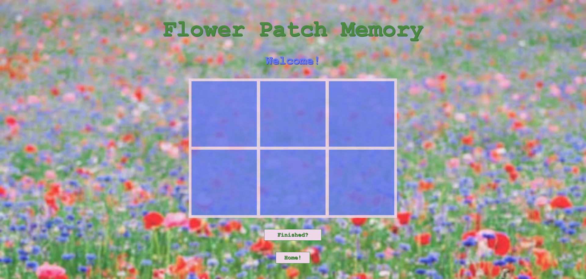

# Flower Patch Memory

## A Memory Game Of Flowers

The game starts by taking the player to a home page with instructions on how to play the game. Once ready to play the player can click the "Play the Game!" button and be taken to the playable level page.

The player will play the game by pairing two of the same flower to make a match. The game will have a level where the player will match 6 cards. Once the player completes all the matches they will click the "Finished?" button and the game will end.

## How To Get Started

- Fork and Clone this repository and cd into the repository
- Open the directory with VS code using code . in terminal
- You will find two html files, one css file, and one js file
- One html file is the home page and the other is the playable level
- To view the web page, open index.html in terminal

## Extra Links

[Flower Patch Memory Game](https://flower-patch-memory.surge.sh/index.html)

---

[Trello Board](https://trello.com/invite/b/rfZPE9jB/341e1f953a6daddfb77247f786a8ca36/flowerpatchmemory)

## Credits

[Background Photo](https://unsplash.com/photos/FlZdrpvzORY)

[CornFlower Photo](https://images.unsplash.com/photo-1625687848550-79eefa168c28?ixlib=rb-1.2.1&ixid=MnwxMjA3fDB8MHxzZWFyY2h8MTB8fGNvcm5mbG93ZXJ8ZW58MHx8MHx8&auto=format&fit=crop&w=500&q=60)

[Poppy Photo](https://cdn.pixabay.com/photo/2018/05/25/20/55/poppy-3430058__340.jpg)

[Pink Cosmos Photo](https://cdn.pixabay.com/photo/2019/08/21/18/30/cosmea-4421744__340.jpg)
